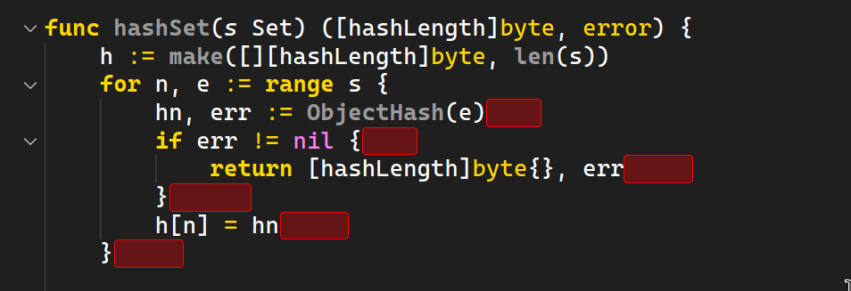

	<h1>Spaced</h1>

	

    <a href="https://github.com/Gael-Lopes-Da-Silva/SpacedVSCode">https://github.com/Gael-Lopes-Da-Silva/SpacedVSCode</a>

 

	
	
	

	

Description
------------------------------------------------------------------

Spaced is a simple extension that detect and highlight trailing whitespaces. It also provides a command to remove all the trailing whitespaces of a file.

Options
------------------------------------------------------------------

Spaced has 2 command available right now. `Spaced: Toggle Hightlight` that turn on or off colors highlighting ans `Spaced: Remove Whitespaces` that remove all the whitespaces from the current file.

~~~json
{
    "spaced.highlight": true, // Enable or disable highlight of whitespaces
    "spaced.maxFileSize": 1000000, // The maximum file size to work with (1mb)
    "spaced.maxLineCount": 10000, // The maximum number of line to work with
	"spaced.borderRadius": 3, // Border radius of the highlight
	"spaced.borderSize": 1, // Border size of the highlight
	"spaced.borderColor": "#ff0000", // Border color of the highlight
	"spaced.backgroundColor": "#ff000050", // Background color of the highlight
}
~~~

Screenshots
------------------------------------------------------------------

How to build
------------------------------------------------------------------

If you want a build of Spaced you can find it in the release section or in the [build](./build/) folder. Else use `vsce package` in the project folder.

How to install
------------------------------------------------------------------

To install, open visual studio code and go to the extention menu. Click on the three dots and click on `Install from VSIX` and choose the `spaced-X.X.X.vsix` file. Or just install it on the market place.